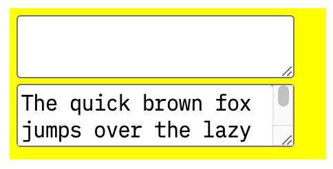
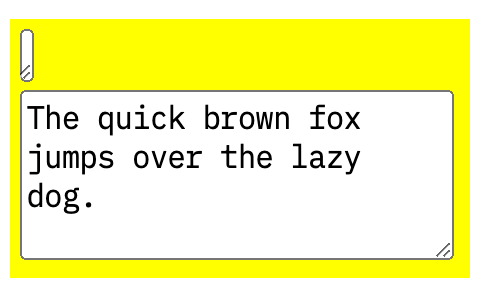

# Auto-growing text form controls

## Problem

Suppose that a web author wants to provide a text control that automatically resizes to a size fit to the entered text.
This can be achieved with some JavaScript code, but we propose a new CSS property to make it easier to achieve.

`<textarea>` and `<input type="text">` elements retain a constant size regardless of
the amount of the entered text, even if its sizing CSS property is set to `auto`.

## Solution

We propose a new CSS property called `field-sizing` to disable this behavior that is unique to form controls.

`field-sizing: fixed;`
The default value. Maintains the current behavior.

`field-sizing: content;`
Disables the form control's behavior of retaining a constant size, allowing size determination to be based on the content.

## Examples

The default `<textarea>` size is something like `10em` x `2lh`, and their size does not change by the amount of the entered text.

```html
<div style="width:11em; background:yellow; padding:4px;">
<textarea>
</textarea>
<br>
<textarea>
The quick brown fox jumps over the lazy dog.
</textarea>
</div>
```


If `field-sizing: content` is specified, the following two `<textarea>` elements will have different sizes.
They are minimum sizes which fit to their content.

```html
<div style="width:11em; background:yellow; padding:4px;">
<textarea style="field-sizing:content;">
</textarea>
<br>
<textarea style="field-sizing:content;">>
The quick brown fox jumps over the lazy dog.
</textarea>
</div>
```


## Coverage

We suppose the `field-sizing` property is applied to the following elements:
* `<textarea>`
* Text-field `<input>`
* `<input type=number>`
* `<input type=file>`<br>
  The control width will depend on a selected file name if `field-sizing: content` is specified.
* List box `<select>`<br>
  The control height will depend on the sum of `<option>` label heights if `field-sizing: content` is specified.
* Drop-down box `<select>`<br>
  THe control width will dpeend on the width of the selected `<option>` label if `field-sizing: content` is specified.

## Considered Alternatives

* Managed by HTML content attributes; e.g. `<textarea rows="auto" maxrows="10">`<br>
  We should not add new behavior to existing presentation attributes, and should not add new presentation attributes.<br>
  https://github.com/whatwg/html/issues/6807#issuecomment-1115141059
  
* Expand the meaning of `min-content` `max-content` keywords for `width` `height` properties<br>
  It will have a compatibility risk, and it's hard to detect the feature because of no new properties/keywords.<br>
  https://github.com/w3c/csswg-drafts/issues/7542#issuecomment-1198807010<br>
  https://github.com/w3c/csswg-drafts/issues/7542#issuecomment-1200526721

* Add a new keyword for `width` `height` properteis; e.g. `height: max-input;`<br>
  We won't be able to apply other keywords to a form control with `height: max-input;`.<br>
  https://github.com/w3c/csswg-drafts/issues/7542#issuecomment-1535228386

Conslusion: Adding new property to disable the current sizing behavior of form controls would be the simplest and the safest.

## Links

* HTML issue: https://github.com/whatwg/html/issues/6807
* CSSWG issue: https://github.com/w3c/csswg-drafts/issues/7542
* Chromestatus: https://chromestatus.com/feature/5176596826161152

